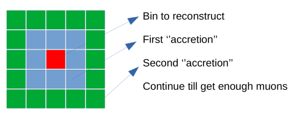

# The algorithm

To have sufficient muons to reconstruct a given direction we integrate the closest bins until we get that minimum number of muons. The reconstructed value is then affected to all acreted bins with different weights in such a way that the main bin has the greater weight. A Gaussian weight centered to the main bin is usually used. At the end of the process, the spatial resolution is reconstructed by appliying a kernel. In the following, the accretion algorithm is described as well as the kernel formula used to distribute the reconstructed density to each bin.

## The accretion algorithm

The accretion algorithm is simply represented in the image below. The red bin is the main bin (the one to be reconstructed). If alone, it has enough number of muons then it is reconstructed. Otherwise, a first acretion is applied to the closed bins (in gray color). If these nine bins have sufficient muons then they are reconstructed. Otherwise, a second acretion is applied and a third unitl we get the minimum number of muons. The reconstructed density $\rho_i$ is then affected to each accreted bin with different weight $w_i$.

The density is reconstructed for the entire (accreted) bins and is affected to each bin with differents weights. Then a new bin is investigated. If a single bin contains enough muons then it is reconstructed alone otherwise the acrretion is applied. At the end of the process, each bin may have multiple entries affected with different weights. These weights come from different accreted bins centered at bins close to the main bin. These weights should take into account the distance between the main bin with respect to the others.

## Kernel formula

An estimation of the density in each direction (bin) is then obtained by weighted average of the contributions of that bin as follows.

$\hat{\rho} = \frac{ \sum_{i=1}^n w_i \times \rho_i }{ \sum_{i=1}^n w_i }$

The weight $w_i$ is chosen as it decreases with the distancce from the main bin to the bin $i$. A Gaussian centered to the main bin could be used to model these weights.