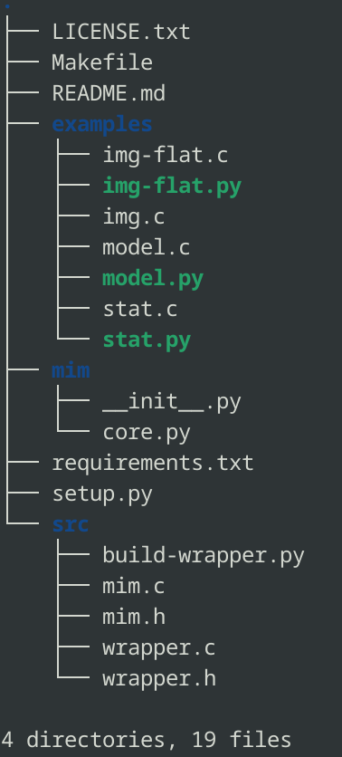

# Installation

Before using the C library or the Python interface, a user must have **MIM** on his/her computer. In the following, we will describe how to get the source code, to compile the C library and use **MIM** to radiography a volcano. 

## Prerequisites

To get the source code, a user must have some software pre-installed on his/her computer. The following describes the prerequisites to be able to use the software.

### Git

To get a cloned of the repository, a user should have git software on his/her computer. If a user does not have Git installed yet on his/her computer, it can be installed from the [Git page](https://git-scm.com/). Assuming git software is already installed, the package can be cloned by typing the following in a terminal:

```git
git clone git@github.com:kvernet/mim.git
cd mim
```

### The contents of the repository
The contents of the repository are as follows:



- **LICENSE.txt** containing the License to use **MIM**
- **Makefile** to compile the package using Gcc compiler and some Python libraries
- **README.md** contains some basic instructions for the **MIM** package
- **examples/** containing the C and Python examples
- **mim/** containing the Python core interface
- **requirements.txt** containing required Python libraries
- **setup.py** used by Makefile to compile the library
- **src/** that contains the source code (.h, .c) and a python file used when compiling the library
- **.gitignore** to exclude files and directories


### Python version 3

A user that wants to use Python language to radiography a target of interest can also use the package. In that case, Python should be installed. If it is not yet, installation instructions can be found on the [Python page](https://www.python.org/).

After installing Python language, make sure that a version 3 or newer is present. A user could verify the Python version that is installed on his/her computer by taping the following in a terminal:

```python
python3 --version
```
The result should be something like "Python 3.x.y". If so, the user is good to go.


### Gcc compiler and make

By default, all Linux machines have a **Gcc compiler** and a **make** already installed. To check the installed version, execute the following in a terminal:

```bash
gcc --version
make --version
```

The user could get **Gcc** and **make** by just executing, as sudo, in a terminal the following:

```bash
sudo apt-get install build-essential -y
```


## Compilation

Some Python libraries are required to be able to compile and use the software. The list is defined in requirements.txt. To install them, execute the following in a terminal in the source code:

```python
pip3 install -r requirements.txt
```

If installation failed, try the highly recommended steps to create a Python virtual environment :

Type the following in a terminal :
```python
python3 -m venv path_to_new_virtual_environment
```

Where **path_to_new_virtual_environment** is the path of choice to have the virtual environment. Then export **path_to_new_virtual_environment/bin** to the PATH variable as :

```bash
export PATH=path_to_new_virtual_environment/bin:$PATH
```

The user can also activate the virtual environment. Refer to Python virtual environment for details.

To compile the library, go to where the source code is on the computer and type the following:

```cmake
make package
```
By executing the above instruction, the library should be installed in the lib/ directory. Note that, that instruction uses the setup.sh and the files in the src/ directory to build the dynamic library named mim. It also links the h header file (mim.h) into mim/include/ and the library (libmim.so) into mim/lib/. And finally it creates the wrapped file mim/wrapper.abi3.so used in Python applications by mim/core.py.

The following instruction allows to clean the source code after compilation. It can be used to re-compile the package :

```bash
make clean
```

## Examples

The C examples could be compiled and installed by executing the following instruction:

```cmake
make examples
```
They are linked to the library. Thus, by executing the above instruction, the library is created if it does not already exist. The examples binary will be installed in the bin/ directory.

The Python examples, on the other hand, can be executed directly using Python.


### Export the package

After the installation, in the root source code, export the package as follows :
```bash
export PYTHONPATH=$PWD:$PYTHONPATH
```